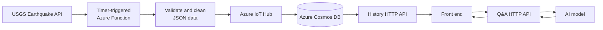

# Lytir AI

Lytir AI is an Azure Functions backend for collecting earthquake data, storing
it as an event stream, serving historical observations, and answering
earthquake-related questions with an AI model.

> This project is under active development. Function names, HTTP routes, and
> data contracts will be documented as they are implemented.

## What the application does

1. A timer-triggered function periodically downloads earthquake data from the
   [USGS Earthquake Catalog API](https://earthquake.usgs.gov/fdsnws/event/1/).
2. The function validates, cleans, and normalizes the JSON response.
3. Clean earthquake events are sent to Azure IoT Hub and persisted in the
   connected Azure Cosmos DB data store.
4. An HTTP API reads historical earthquake data from Cosmos DB for the front
   end.
5. A second HTTP API sends a user's question and the relevant context to an AI
   model and returns a single-turn answer. Each question is handled
   independently; the backend does not maintain a conversation history.

## Architecture



## Function responsibilities

| Function | Trigger | Responsibility |
| --- | --- | --- |
| Firebase API proxy | `GET\|POST /api/proxy/{target}` | Verify Firebase ID tokens and dispatch allowlisted front-end API requests |
| Earthquake acquisition | `POST /api/earthquakes/acquire` | Fetch USGS data, normalize it, and publish events to IoT Hub |
| Earthquake ingestion | Timer | Run the same ingestion pipeline on the configured schedule |
| Earthquake history | `GET /api/earthquakes[/{id}]` | Query stored earthquake observations from Cosmos DB |
| AI model diagnostic | `POST /api/diag/ai-qa` | Make one generic request through the enabled PydanticAI model profile |
| Earthquake Q&A | HTTP | Accept one question, call the configured AI model, and return its answer |

The acquisition endpoint returns HTTP 200 with `reason: "OK"` after every source
event is normalized and published. Pipeline exceptions, malformed source
events, and partial publishing failures return HTTP 500 with details in
`reason`. Every response includes aggregate `counts`, normalized event
`metadata`, and `utc_now` in ISO 8601 format. Normal publishing responses do
not include raw USGS event payloads.

Send `{"dry_run": true}` to download and normalize without publishing to IoT
Hub. A dry-run response also includes the complete normalized envelopes under
`events`. Omitting `dry_run` runs the normal publishing flow.

Invoke the deployed endpoint with a placeholder function key:

```bash
curl --request POST \
  --header "Content-Type: application/json" \
  --data '{"dry_run": true}' \
  "https://lytir-ai-dpdjcpd2h3cncag5.southcentralus-01.azurewebsites.net/api/earthquakes/acquire?code=<FUNCTION_KEY>"
```

Replace `<FUNCTION_KEY>` locally; never commit or share the real key. Remove
the request body or set `dry_run` to `false` to publish events to IoT Hub.

See the [earthquake ingestion pipeline design](docs/earthquake-ingestion-pipeline.md)
for the event envelope and service boundaries.

Retrieve deduplicated earthquake metadata with optional time, location-radius,
and magnitude filters:

```bash
curl \
  --header "x-functions-key: <FUNCTION_KEY>" \
  "https://<FUNCTION_APP>/api/earthquakes?start_time=2026-09-11T00:00:00Z&end_time=2026-09-12T00:00:00Z&fmt=json"
```

Use `format=csv` or its `fmt=csv` alias for CSV output. An exact stored record
is available from `GET /api/earthquakes/{id}`. See the
[earthquake retrieval API design](docs/earthquake-retrieval-api.md) for the
complete filter, deduplication, response, and error contracts.

The [AI model service design](docs/ai-model-service.md) documents model-profile
selection, native OpenAI and Foundry authentication, and the diagnostic API.

## Azure resources

The application is designed to use:

- Azure Functions for scheduled ingestion and HTTP APIs
- Azure IoT Hub for earthquake event ingestion
- Azure Cosmos DB for historical earthquake storage
- An AI model endpoint for single-turn question answering
- The USGS Earthquake Catalog API as the source dataset

## API security

All HTTP-triggered functions use Azure Functions function-level authorization
by default. Requests must provide a valid function key, normally through the
`x-functions-key` header or `code` query parameter. Anonymous access must be an
explicitly documented exception.

Function keys must not be committed or embedded in browser-delivered front-end
code. A public front end should access the APIs through an appropriate
authentication or gateway layer, such as Microsoft Entra authentication or
Azure API Management.

`GET|POST /api/proxy/{target}` is the documented authorization-level
exception. The Functions host permits anonymous access to the proxy, which
validates a Firebase Authentication ID token from the `Authorization: Bearer`
header before dispatching an allowlisted target. `GET /api/proxy/diag` is the
only target for which the token is optional: it returns the normal diagnostic
response without a valid token and adds a `security` object when a valid token
is supplied. `security.claims` contains the decoded verified claims, while
`security.role` is `admin` when the token's email appears in the
comma-separated `ADMIN_USER_EMAILS` setting and `user` otherwise. See the
[Firebase API proxy design](docs/firebase-api-proxy.md) for the route mapping
and security contract.

## Local development

### Prerequisites

- Python 3.13
- Azure Functions Core Tools 4.x
- Visual Studio Code with the recommended Azure Functions and Python
  extensions
- Azurite when developing functions that require Azure Storage

Create the virtual environment and install the dependencies:

```bash
python3 -m venv .venv
source .venv/bin/activate
python -m pip install -r requirements-dev.txt
```

On Windows PowerShell, activate it with `.\.venv\Scripts\Activate.ps1` instead.

`requirements.in` contains direct runtime dependencies and generates the pinned
`requirements.txt` used by Azure. `requirements-dev.in` adds development tools
and generates `requirements-dev.txt` for developers and CI. Edit only the `.in`
files; the `.txt` files are generated locks.

After changing either input file, regenerate both lock files:

```bash
python -m piptools compile --allow-unsafe --strip-extras --no-emit-index-url --no-emit-trusted-host --output-file=requirements.txt requirements.in
python -m piptools compile --allow-unsafe --strip-extras --no-emit-index-url --no-emit-trusted-host --output-file=requirements-dev.txt requirements-dev.in
```

Create the local settings file from the tracked example:

```bash
cp local.settings.example.json local.settings.json
```

On Windows PowerShell, use
`Copy-Item local.settings.example.json local.settings.json` instead.

The example contains the minimum settings needed by the current application.
Add placeholder keys to it as new integrations require configuration, but never
add real credentials. Keep actual local credentials and service connection
details in `local.settings.json`; that file must not be committed. Deployed
environments should provide their configuration through Azure Function App
settings and use managed identities where supported.

Application-owned environment variables are read centrally by `ServiceSettings`;
Azure Functions host settings remain under platform control:

| Setting | Required | Purpose |
| --- | --- | --- |
| `USGS_EARTHQUAKE_API_URL` | Yes | Configured USGS GeoJSON feed URL |
| `USGS_CRON_JOB_SCHEDULE` | Yes | Six-field NCRONTAB schedule for earthquake acquisition |
| `IOT_HUB_DEVICE_CONNECTION_STRING` | Yes | Device-scoped credential used to publish events to IoT Hub |
| `JSON_FILE_ENCODING` | No | JSON text encoding; defaults to `utf-8` |
| `COSMOS_EARTHQUAKE_DB_CONNECTION_STRING` | Yes for retrieval | Secret used to connect to the earthquake Cosmos account |
| `COSMOS_EARTHQUAKE_DB_NAME` | Yes for retrieval | Database containing routed earthquake messages |
| `COSMOS_EARTHQUAKE_DATA_CONTAINER_NAME` | Yes for retrieval | Container containing routed earthquake messages |
| `EARTHQUAKE_QUERY_MAX_WINDOW_HOURS` | No | Maximum permitted query window; defaults to `720` hours |
| `EARTHQUAKE_QUERY_MAX_RADIUS_KM` | No | Maximum permitted location radius; defaults to `1000` km |
| `AI_QA_MODEL_<PROFILE>_ENABLED` | Yes for AI access | Enables exactly one configured model profile |
| `AI_QA_MODEL_<PROFILE>_ENDPOINT_URL` | Yes for AI access | Native OpenAI or Azure AI Foundry Responses endpoint |
| `AI_QA_MODEL_<PROFILE>_ASSET_NAME` | Yes for AI access | Model deployment or asset sent to the API |
| `AI_QA_MODEL_<PROFILE>_MODEL_NAME` | Yes for AI access | Underlying model family |
| `AI_QA_MODEL_<PROFILE>_API_KEY` | Native only | Native OpenAI secret; must be empty for Foundry managed identity |
| `AI_QA_MODEL_<PROFILE>_CONTEXT_WINDOW_TOKENS` | Yes for AI access | Application context budget for one model request |
| `AI_QA_MODEL_<PROFILE>_MAX_OUTPUT_TOKENS` | Yes for AI access | Provider output-token ceiling |
| `AI_QA_MODEL_<PROFILE>_TIMEOUT_SECONDS` | No | Model request timeout; defaults to `30` seconds |
| `EARTHQUAKE_DATA_AVAILABLE_FROM_UTC` | Yes for AI Q&A | Earliest earthquake occurrence time claimed by the Q&A service |
| `AI_QA_MAX_MODEL_REQUESTS` | No | Model requests per Q&A call; defaults to `5` |
| `AI_QA_MAX_TOOL_CALLS` | No | Earthquake-data skill calls per Q&A call; defaults to `3` |
| `AI_QA_MAX_EXECUTION_SECONDS` | No | Overall Q&A deadline; defaults to `210` seconds |
| `SERVICE_MODE` | No | Exact value `debug` enables debug response fields and full model request/response logging |

Instantiate `ServiceSettings` only where application settings are needed. Do not
log or expose the IoT Hub connection string.

### Run and debug

Open the repository root in Visual Studio Code, select **Attach to Python
Functions** in the Run and Debug view, set any breakpoints, and press `F5`. The
pre-launch task installs `requirements.txt`, starts the local Functions host,
and attaches the Python debugger on port `9091`.

The diagnostic endpoint is then available at:

```text
http://localhost:7071/api/diag?example=value
```

Its `environment_variables` object lists every known application setting and
reports whether it has a non-empty value. It never returns setting values.

Verify the enabled AI model profile with a billable, single-round request:

```bash
curl --request POST \
  --header "Content-Type: application/json" \
  --data '{"question":"What is the capital of Japan?"}' \
  "http://localhost:7071/api/diag/ai-qa"
```

Foundry profiles use `DefaultAzureCredential`. Sign in with Azure CLI for local
development and grant the deployed Function App managed identity access to the
model before testing in Azure.

Ask a stateless, skill-routed Lytir question with:

```bash
curl --request POST \
  --header "Content-Type: application/json" \
  --data '{"question":"Were there earthquakes near Dallas in the last hour?"}' \
  "http://localhost:7071/api/ai/qa"
```

Do not enable `SERVICE_MODE=debug` in shared or production environments. It
logs full model instructions, question context, retrieved evidence, and parsed
model responses for local troubleshooting.

Azure Functions Core Tools does not enforce function keys locally by default.
The deployed endpoint still requires function-level authorization. Use
`func start --enableAuth` when local testing must exercise authentication.

### Quality checks

Run the same checks enforced for pull requests targeting `dev`:

```bash
python -m ruff format --check .
python -m ruff check .
python -m mypy
python -m pytest
python -m compileall -q function_app.py
python -c "import function_app"
```

Apply automatic formatting and safe lint fixes with:

```bash
python -m ruff format .
python -m ruff check --fix .
```

The project uses Python 3.13 as recorded in `.python-version`. Tool settings for
Ruff, mypy, and pytest are centralized in `pyproject.toml`, and shared editor
defaults are in `.editorconfig`.

## Development deployment

The [development deployment workflow](.github/workflows/deploy-dev.yml) deploys
the current `dev` branch after a pull request targeting `dev` is merged. Closing
a pull request without merging it, pushing directly to `dev`, or updating a
different branch does not trigger this workflow.

Create a GitHub environment named `dev`, restrict its deployment branches to
`dev`, and configure the following environment secret and variables:

| Type | Name | Value |
| --- | --- | --- |
| Secret | `AZURE_FUNCTIONAPP_PUBLISH_PROFILE` | Complete XML contents of the publish profile downloaded from the development Function App |
| Variable | `AZURE_FUNCTIONAPP_NAME` | Exact Function App name, not its URL or resource group |
| Variable | `AZURE_FUNCTIONAPP_SKU` | `flexconsumption` for a Flex Consumption app; leave unset for a regular Linux plan |

The Function App must have **SCM Basic Auth Publishing Credentials** enabled.
Publish-profile authentication does not require an Azure client ID, tenant ID,
subscription ID, or an Azure login step.

The workflow requires `host.json` at the repository root and performs a remote
build in Azure. Files matched by [.funcignore](.funcignore), including
repository automation, documentation, tests, local settings, and temporary
artifacts, are excluded from the deployment package.

The publish profile deploys application code only. Runtime settings and service
configuration for storage, IoT Hub, Cosmos DB, and the AI model must be managed
separately in the Azure Function App.

## Development workflow

- Use `dev` as the integration branch and `main` as the release branch.
- Create feature branches from the latest `dev` using
  `<ticket-number>-<kebab-case-description>`.
- Open feature pull requests against `dev` and include `Refs #<ticket-number>`
  in commit messages and pull request descriptions.
- Promote releases with pull requests from `dev` to `main`; feature branches
  must not target `main` directly.
- Run checks relevant to the affected code before committing or opening a pull
  request.
- Pull requests targeting `dev` run formatting, lint, type, test, compile, and
  import checks through the code-quality workflow. During the R&D phase, this
  workflow intentionally does not run again for `dev`-to-`main` promotion PRs
  because `main` has no separate deployment path. Add `main` as a CI target when
  that changes.

## Project layout

| Path | Purpose |
| --- | --- |
| `function_app.py` | Azure Functions entry point and function registrations |
| `tests/` | Automated pytest suite |
| `requirements.in` | Direct production dependency manifest |
| `requirements.txt` | Pinned production dependencies used for deployment |
| `requirements-dev.in` | Direct development and quality-tool dependencies |
| `requirements-dev.txt` | Pinned development and CI dependencies |
| `pyproject.toml` | Ruff, mypy, and pytest configuration |
| `.github/workflows/quality.yml` | Pull-request quality checks for `dev` |
| `.github/workflows/deploy-dev.yml` | Post-merge deployment to the development Function App |

## License

Licensed under the [Apache License 2.0](LICENSE).
