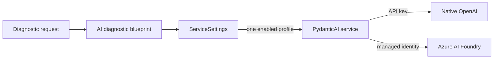

# AI model service

## Purpose

The AI model service gives application code one provider-neutral way to make a
single-round model request through PydanticAI. Its first caller is the
function-protected `POST /api/diag/ai-qa` endpoint, which verifies model access
with a generic question.

This foundation does not retrieve earthquake data, construct grounded prompts,
or expose the production earthquake Q&A contract. Those responsibilities belong
to a later feature.

## Runtime flow



`ServiceSettings` discovers model profiles from environment variables. The
blueprint passes the enabled profile to a cached model-service factory. The
factory builds an `OpenAIResponsesModel` and the diagnostic endpoint awaits one
agent run with no tools, retries, streaming, or message history.

The cached service and its asynchronous HTTP client are reused across warm
Function App invocations. This avoids rebuilding connection pools for every
request.

## Model profiles

All profile variables use this convention:

```text
AI_QA_MODEL_<PROFILE_NAME>_<SETTING>
```

For example, `AI_QA_MODEL_NATIVE_GPT_ENABLED` and
`AI_QA_MODEL_AZURE_GPT_ENABLED` describe two independent profiles. Exactly one
profile must have `ENABLED=true`. Zero or multiple enabled profiles are treated
as configuration errors; there is no automatic fallback.

| Profile setting | Required | Meaning |
| --- | --- | --- |
| `ENABLED` | Yes | Strict `true` or `false`; exactly one profile is enabled |
| `ENDPOINT_URL` | Yes | HTTPS OpenAI-compatible v1 base URL or full `/responses` URL |
| `ASSET_NAME` | Yes | Deployment or asset identifier sent in the API `model` field |
| `MODEL_NAME` | Yes | Underlying model family used for PydanticAI capability selection and diagnostics |
| `API_KEY` | Native only | Native OpenAI credential; must be empty for Foundry |
| `CONTEXT_WINDOW_TOKENS` | Yes | Application token budget for input plus reserved output in one model request |
| `MAX_OUTPUT_TOKENS` | Yes | Maximum generated tokens, including visible output and reasoning tokens |
| `TIMEOUT_SECONDS` | No | Per-request model timeout; defaults to `30` seconds |

The loader accepts an endpoint ending in `/responses` for compatibility with
existing configuration, then normalizes it to the v1 base URL expected by the
OpenAI client. Issue #24 replaces the ambiguous `MAX_TOKENS` setting with the
two explicit token settings above for both native OpenAI and Azure AI Foundry
profiles. The old name is not treated as an alias because silently changing its
meaning would make deployments difficult to reason about.

The initial application budget for both configured profiles is:

```text
AI_QA_MODEL_NATIVE_GPT_CONTEXT_WINDOW_TOKENS=32768
AI_QA_MODEL_NATIVE_GPT_MAX_OUTPUT_TOKENS=16384
AI_QA_MODEL_AZURE_GPT_CONTEXT_WINDOW_TOKENS=2097152
AI_QA_MODEL_AZURE_GPT_MAX_OUTPUT_TOKENS=1048576
```

Each profile allocates a total application context budget equal to twice its
configured maximum output. `CONTEXT_WINDOW_TOKENS` is an application limit and
is not sent to the provider. `MAX_OUTPUT_TOKENS` is the ceiling supplied through
PydanticAI as the Responses API `max_output_tokens` field. The application
accepts output ceilings through `1048576`; the selected provider and deployment
remain authoritative and may reject a configured value that exceeds their
runtime capability.

Before each call, the service estimates the complete input, including system
instructions, tool schemas, question, Lytir context, and accumulated evidence.
The effective output ceiling is the smaller of the configured output ceiling
and the context budget remaining after input and a safety margin. A request is
not sent when no safe output capacity remains.

Other legacy profile variables are ignored until an implemented requirement
needs them. In particular, the diagnostic call does not use streaming,
sampling penalties, proxy credentials, or descriptive notes.

## Authentication and compliance

Authentication is deliberately inferred from the selected profile's API-key
value and then checked against its endpoint:

| API key | Required endpoint | Authentication |
| --- | --- | --- |
| Non-empty | `api.openai.com` | Native OpenAI API key |
| Empty | Azure AI Foundry host | `DefaultAzureCredential` bearer token |

An Azure endpoint with an API key is rejected as a compliance violation. A
native OpenAI endpoint without a key is rejected as a configuration error. This
prevents a missing secret from silently changing providers.

For Foundry, the service obtains tokens for
`https://ai.azure.com/.default`. `DefaultAzureCredential` can use a developer's
Azure credentials locally and the Function App's managed identity after
deployment. The identity must be granted appropriate access to the deployed
model.

The Foundry v1 endpoint is OpenAI-compatible, so the implementation supplies an
Azure bearer-token callback to `AsyncOpenAI` and gives that client to
PydanticAI's `OpenAIProvider`. Calling code sees the same PydanticAI agent for
both authentication paths.

No credential, access token, endpoint configuration, or provider exception is
returned to the caller. Credentials must remain in local or deployed settings
and must never be committed.

## Diagnostic API

The diagnostic is a billable model call, not a passive health check. It uses
function-level authorization and accepts only `POST`.

Request:

```json
{
  "question": "What is the capital of Japan?"
}
```

`question` is stripped, must be non-empty, and is limited to 4,000 characters.
Unknown request fields are rejected. The model returns a structured answer and
a self-reported confidence from `0` to `1`. This confidence is diagnostic model
output, not a calibrated probability or a correctness guarantee.

Successful response:

```json
{
  "question": "What is the capital of Japan?",
  "answer": "Tokyo.",
  "confidence": 0.99,
  "usage": {
    "requests": 1,
    "input_tokens": 42,
    "output_tokens": 18,
    "total_tokens": 60
  },
  "execution_seconds": 1.234567,
  "model_host": "azure",
  "model_profile": "AZURE_GPT",
  "model_name": "gpt-5.6-sol",
  "utc_now": "2026-09-11T18:00:00Z"
}
```

Token counts come from the provider response; the service does not estimate
them locally. PydanticAI normally maps those counters, but its price-catalog
lookup can return zero for an Azure deployment alias it does not recognize. A
small Responses-model adapter therefore preserves the response's
`input_tokens` and `output_tokens` directly before PydanticAI aggregates them.
`execution_seconds` is wall-clock time measured from entry into the Function
handler through completion of the model call. `model_host` is the stable public
classification `azure` or `native_openai`. The host, profile, and underlying
model fields identify which enabled configuration was exercised without
returning its endpoint, deployment name, or credentials.

Invalid requests return HTTP 400, invalid model configuration returns HTTP 500,
and provider or identity failures return HTTP 503. Detailed exceptions are
logged server-side; responses contain safe generic messages.

## Stateless behavior

Each request creates one independent agent run. The service does not provide
message history, a previous response ID, or a conversation ID, and configures
the Responses API with `store=false`. It also provides no tools in this ticket.

## References

- [PydanticAI OpenAI models](https://ai.pydantic.dev/models/openai/)
- [OpenAI Responses API](https://platform.openai.com/docs/api-reference/responses)
- [Azure AI Foundry Responses API](https://learn.microsoft.com/en-us/azure/foundry/openai/how-to/responses?tabs=python)
- [Repository copy of the Responses API reference](openai-responses-api.md)
