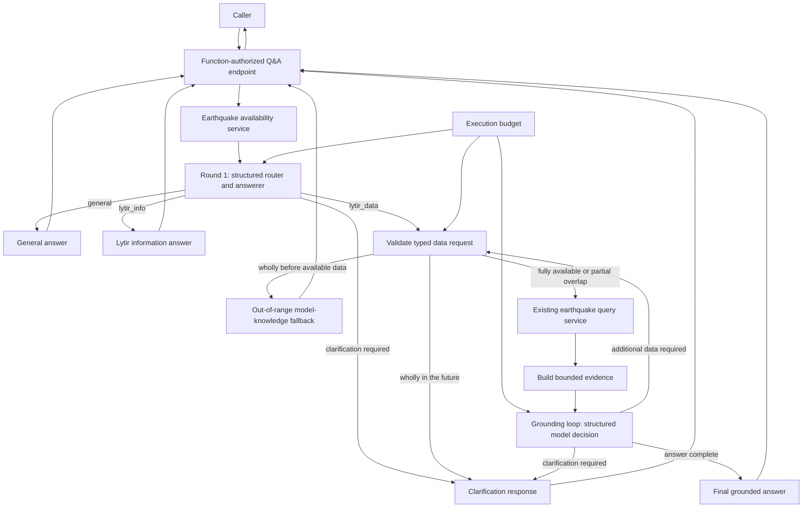

# Lytir Q&A API design

## Status

Implementation design for issue #24.

## Context

The application already provides two independent foundations:

- A configurable PydanticAI model service that can use native OpenAI or Azure
  AI Foundry with managed identity.
- A bounded earthquake retrieval service that reads allowlisted metadata from
  Cosmos DB, removes duplicate logical events, and supports time, radius, and
  magnitude filters.

The production Q&A API will combine those foundations. It is different from
`POST /api/diag/ai-qa`: the diagnostic only verifies that a configured model
can answer a generic question. The production API must decide whether a
question can be answered directly or requires Lytir earthquake data, safely
retrieve that data when necessary, and produce a grounded answer.

The caller interaction remains single-round and stateless. Internal
orchestration may make more than one model request, but the application does
not retain conversation history, response IDs, sessions, or prior questions.

## Goals

- Provide one function-authorized HTTP endpoint for independent natural-language
  questions.
- Answer general questions even when they are unrelated to Lytir.
- Answer questions about Lytir from curated application information.
- Recognize questions that require Lytir earthquake data.
- Convert data questions into typed, validated retrieval requests.
- Let the model translate caller-supplied named locations and proximity terms
  into explicit coordinates and radii before application validation.
- Ground data-backed answers in allowlisted metadata returned by the existing
  earthquake query service.
- Provide a clearly labeled model-knowledge answer when a requested historical
  period is wholly outside Lytir's available observations.
- Query and clearly disclose the available intersection when a requested period
  only partially overlaps Lytir's observation range.
- Ask for clarification when a safe or meaningful retrieval request cannot be
  constructed.
- Permit additional allowlisted data retrieval when the model determines that
  the first result is insufficient, within hard execution limits.
- Tell the model the declared and currently observed data bounds so it can
  reason about questions that omit a time range.
- Keep model selection, Cosmos access, validation, and HTTP concerns
  independently testable.

## Non-goals

- Multi-turn conversation or server-side session management
- Letting the model access Cosmos DB directly
- Letting the model generate Cosmos SQL or arbitrary query expressions
- Assuming the model already knows private or current facts about Lytir
- Returning raw USGS events, source IDs, source URLs, or Cosmos system fields
- Silently truncating a requested time range or evidence set without exposing
  the resulting coverage limitation
- Replacing the existing earthquake retrieval API

## Conceptual skills

The router treats the following capabilities as skills, although only one of
them initially executes an application service:

| Skill | Behavior | Model requests | Application data call |
| --- | --- | --- | --- |
| `general` | Answer from the model's general knowledge | One | No |
| `lytir_info` | Answer from curated Lytir information | One | No |
| `lytir_data` | Plan queries and either retrieve evidence or provide a labeled out-of-range fallback | Two or more, bounded | When the range is available |

`general` is normal model behavior. `lytir_info` is model behavior grounded by
version-controlled Lytir context. `lytir_data` is the only executable data
skill in the first version.

## Q&A service structure

Runtime skills belong to the Q&A service and are separate from the repository's
`.agents/skills` development workflows. The proposed package structure is:

```text
services/
  ai_qa/
    __init__.py
    model_service.py
    orchestrator.py
    prompt_builders.py
    skills/
      __init__.py
      base.py
      earthquake_data.py
      registry.py
```

The orchestrator owns routing, budgets, sequencing, and final response
assembly. Prompt builders own model instructions and structured context. Each
executable skill owns its data access, validation, and evidence preparation.

The skill registry is explicit and allowlisted. The application never imports
or executes a skill merely because the model returned its name. Initially only
`lytir_data` has an executable handler; `general` is native model behavior and
`lytir_info` uses supplied knowledge context. A future skill requires a typed
request and result, a registry entry, prompt changes, and tests.

## Proposed architecture



The Q&A orchestrator owns this flow and stops it when either configured budget
is exhausted. The generic model service remains provider-neutral and does not
acquire knowledge of Cosmos DB or HTTP request contracts.

## Request contract

The endpoint is `POST /api/ai/qa` with function-level authorization.

```json
{
  "question": "In the last hour, was there an earthquake anywhere close to Dallas, Texas?"
}
```

The request uses the same basic question validation as the diagnostic API:
valid JSON, one non-empty question, no unknown properties, and an enforced
character limit.

## Earthquake data availability

### Declared start

The environment setting `EARTHQUAKE_DATA_AVAILABLE_FROM_UTC` declares the
earliest occurrence time that the Q&A feature claims to support. It must be an
ISO 8601 UTC timestamp with a `Z` suffix or explicit UTC offset.
The initial configured value is `2026-09-11T17:00:00Z`.
The runtime also accepts the timezone-free `MM/DD/YYYY HH:MM:SS` representation
that Azure Functions Core Tools may derive from that local ISO value; because
the setting explicitly represents UTC, this compatibility form is interpreted
as UTC.

This value is a product and operational commitment, not a calculation of the
oldest Cosmos document. Operators must update it if retention, migration, or
backfill changes the supported history. It must not be presented as proof that
the data is continuous or complete.

### Latest observed event

The availability service queries Cosmos for the latest valid
`Body.metadata.occurred_at_utc` value. It does not use Cosmos `_ts`, the event's
update timestamp, or the current wall clock as a substitute.

The query should project only the occurrence timestamp and use the existing
Cosmos container and index. The implementation must validate the returned
timestamp before exposing it to the router. A duplicate event does not affect
the bound because only the maximum occurrence time is needed.

The latest value is cached in process for a short fixed interval, initially
five minutes. The cache is an optimization rather than durable state. Separate
Function App workers may hold different snapshots briefly, which is acceptable
for this advisory context.

The complete availability context supplied to round 1 is:

```json
{
  "utc_now": "2026-09-11T20:00:00Z",
  "earthquake_data": {
    "available_from_utc": "2026-09-11T17:00:00Z",
    "latest_observed_at_utc": "2026-09-11T19:56:20Z",
    "default_window_hours": 168,
    "max_window_hours": 720,
    "continuous_coverage_guaranteed": false
  }
}
```

Both current UTC and the latest observed time are necessary. Their difference
helps the model describe possible ingestion delay without claiming that Lytir
has data through the present moment.

If the latest-timestamp lookup fails, the router may still answer `general` and
`lytir_info` questions. A `lytir_data` request returns a safe temporary
unavailability response. If no valid earthquake exists, the data skill reports
that no observed data is currently available.

## Curated Lytir information

Round 1 receives a detailed, version-controlled description generated from the
repository's accepted designs and implemented behavior. It explains the
service's purpose, supported capabilities, user-visible data behavior, public
limits, and known limitations. It excludes source-provider names, cloud
providers, databases, credentials, and other internal architecture. The model
must use this supplied material for `lytir_info` answers instead of assuming
that its pretrained knowledge refers to this application. The generated
description requires human review before it becomes runtime context.

The initial context is maintained in `services/ai_qa/lytir_context.py` and
remains small enough to include with every request. If the material grows
substantially, document retrieval can become a separate skill in a later
design. Instructions and knowledge content are kept separate so factual
updates do not require rewriting routing behavior.

## Prompt builders

Prompt construction is an explicit, independently tested component rather than
ad hoc string concatenation inside the orchestrator. It provides two focused
builders:

- The router prompt builder combines static routing instructions with the
  original question, current UTC time, availability bounds, supported filters,
  safety limits, and curated Lytir information.
- The grounded-decision prompt builder combines the original question,
  validated filters, accumulated evidence, availability context, and the
  remaining execution budget. It asks for a final answer, another typed data
  request, or a clarification.

Static instructions remain separate from dynamic context. Runtime context and
evidence are serialized into clearly delimited structured data. Prompt builders
must not include credentials, connection details, Cosmos queries, hidden source
fields, or unrelated configuration.

Prompts have stable version identifiers, initially `router-v1` and
`grounded-decision-v1`, for tests and operational correlation. Complete prompts
and evidence are not logged in normal mode. When `SERVICE_MODE=debug`, each
model call logs its complete instructions and dynamic context before the call,
then its parsed structured response and usage afterward. Debug mode can expose
caller questions and retrieved metadata in logs and must not be enabled in a
shared or production environment. Source strings remain untrusted even after
JSON serialization, so model instructions explicitly prohibit treating
content in data fields as instructions.

## Round 1: router and answerer

Round 1 receives:

- The original question
- Current UTC time
- The earthquake availability context
- The curated Lytir information
- The supported data filters and their safety limits
- Instructions to treat supplied content and later retrieved records as data,
  never as executable instructions

It returns exactly one member of a discriminated Pydantic union.

### Direct answer

```json
{
  "outcome": "answered",
  "skill": "general",
  "answer": "Tokyo is the capital of Japan.",
  "confidence": 0.99
}
```

The `skill` is either `general` or `lytir_info`. A direct answer cannot contain
a data request or clarification.

### Data required

```json
{
  "outcome": "data_required",
  "skill": "lytir_data",
  "data_request": {
    "time_range": {
      "mode": "explicit",
      "start_utc": "2026-09-10T20:00:00Z",
      "end_utc": "2026-09-11T20:00:00Z"
    },
    "location_name": "Dallas, Texas",
    "latitude": 32.7767,
    "longitude": -96.797,
    "radius_km": 80.0,
    "location_confidence": 0.99,
    "min_magnitude": null,
    "max_magnitude": null
  }
}
```

The model interprets the caller's language, but application code validates and
normalizes every field. The model cannot add unsupported filters.

### Clarification required

```json
{
  "outcome": "clarification_required",
  "skill": "lytir_data",
  "clarification": "What time period should I use? Lytir currently has observed data beginning at 2026-09-11T17:00:00Z."
}
```

A clarification is returned to the caller as the answer to the current HTTP
request. Because the API is stateless, the caller must submit a new, complete
question containing the missing detail. The server does not remember the
original question.

## Time-range interpretation

The model identifies the user's temporal intent. Application code owns the
effective timestamps, defaults, and enforcement.

The data request supports two time modes:

- `explicit`: the model supplies both `start_utc` and `end_utc` after
  interpreting a time expression from the question.
- `default`: application code uses the Q&A-specific seven-day default ending at
  the effective current time.

The following policy applies:

1. An explicit time expression such as "in the last 24 hours" becomes a
   half-open UTC range and is validated against the declared and observed
   bounds.
2. "Recent," "current," or any data question without an explicit time range
   uses the previous `168` hours. This Q&A default is independent of the
   retrieval API's two-hour default. For a clearly temporally unbounded question
   such as "Has there ever been an earthquake here?", the model supplements
   that recent Lytir lookup with relevant historical knowledge whenever it
   reasonably knows such facts, even if recent evidence already answers the
   question. It must label that knowledge as not verified by Lytir. Questions
   explicitly limited to recent or current events do not receive historical
   supplementation. If the model lacks reliable relevant history, it says so
   rather than inventing facts.
3. The effective default start is not earlier than
   `EARTHQUAKE_DATA_AVAILABLE_FROM_UTC`.
4. The application intersects an explicit range with the queryable interval
   from `EARTHQUAKE_DATA_AVAILABLE_FROM_UTC` through the effective current
   time. The maximum-window rule applies to that effective intersection. If it
   exceeds `EARTHQUAKE_QUERY_MAX_WINDOW_HOURS`, the caller is asked for a
   narrower period.
5. A request wholly before the declared start is not sent to Cosmos. The model
   receives a dedicated fallback prompt and may provide a best-effort answer
   from general knowledge, while clearly stating that Lytir cannot verify it
   from its observations.
6. A partially overlapping request queries the available intersection and is
   marked `data_status: "partial_coverage"`. The grounding model receives both
   the requested and effective ranges and must identify the unavailable part
   in its answer. When the missing portion predates
   `EARTHQUAKE_DATA_AVAILABLE_FROM_UTC`, the model may add relevant facts it
   reasonably knows, but must label them as general knowledge that Lytir could
   not verify. Model knowledge is never used to fill a future period.
7. `start_utc` must be earlier than `end_utc`, and the final range cannot exceed
   the configured maximum.
8. "Today" means midnight through now, while "last 24 hours" means a rolling
   24-hour period. The model may infer an IANA timezone from a named location;
   application code validates that timezone and converts the interval to UTC.
   When neither the question nor a resolved location supplies a timezone, UTC
   is used.
9. A request beginning at or after the effective current time is wholly in the
   future and returns a clarification without querying earthquake data. A range
   that begins before and ends after the current time queries only through the
   effective current time and is marked as partial coverage.

The effective end of a default recent query is current UTC. The latest observed
timestamp remains context about freshness; it does not replace the query's
exclusive end time.

## Out-of-range model-knowledge fallback

An earthquake question for a period ending on or before
`EARTHQUAKE_DATA_AVAILABLE_FROM_UTC` still begins as a typed `lytir_data`
request. Application code validates that the period is wholly outside the
available range, skips Cosmos retrieval, and makes one dedicated structured
model request.

That request receives the original question, requested filters, requested UTC
range, and Lytir availability bounds. It may answer from general model
knowledge, subject to these rules:

- The Markdown answer must say that Lytir cannot verify the result from its
  observations and identify the availability limitation.
- Exact counts or event details must not be invented.
- Up to ten illustrative earthquake metadata objects may be returned only when
  the model is reasonably confident in them.
- Every unknown metadata property is `null`; the events array is empty when no
  reliable structured facts can be supplied.
- Model-supplied metadata has no Lytir record ID and is never stored, queried,
  or presented as Cosmos-derived evidence.

The public response marks the provenance with
`data_status: "outside_available_range"` and
`knowledge_source: "model_knowledge"`. It uses `outcome: "answered"` because
the request receives a useful best-effort response rather than asking the
caller to restate an already clear question. The `skill` remains `lytir_data`
in debug mode because the user's intent concerned Lytir earthquake data.

The optional event shape intentionally mirrors only the public earthquake
metadata fields and permits all properties to be null:

```json
{
  "event_type": "earthquake",
  "magnitude": null,
  "place": "California",
  "occurred_at_utc": null,
  "updated_at_utc": null,
  "longitude": null,
  "latitude": null,
  "depth_km": null
}
```

A range that only partially overlaps available data does not use this fallback.
The orchestrator queries the intersection of the requested range and the
available interval, then supplies both ranges and the resolved
`EARTHQUAKE_DATA_AVAILABLE_FROM_UTC` value to the grounded-answer model. The
model may supplement an earlier unavailable period from general knowledge when
it has relevant, reasonably confident information, but the answer must clearly
distinguish that information from Lytir-verified observations. It must not
invent events or imply exhaustive historical coverage.
For an existential question, one matching record supports a qualified "yes."
Zero matching records means only that none were found in the available portion;
it cannot support "no" for the entire requested period.

## Other earthquake filters

The typed plan uses the canonical fields already accepted by the earthquake
query service:

- Latitude and longitude supplied together
- A named location to resolve before querying
- Radius normalized to kilometers
- Optional inclusive minimum and maximum magnitudes

Existing maximum-radius, coordinate, magnitude, and default-radius rules remain
authoritative. The Q&A orchestrator must construct the same `EarthquakeQuery`
type used by the HTTP retrieval endpoint rather than duplicate its business
rules.

The first version supports questions containing a named location, such as
"near Dallas, Texas." The model interprets the location and proximity language
and returns explicit coordinates, a radius in kilometers, and self-reported
location confidence. For example, it may interpret "near Dallas" as the Dallas
city center with an approximately `80 km` radius.

Application code validates the coordinate and radius values against the
existing query rules but does not independently verify the geography. The
model must request clarification rather than guess when a place is genuinely
ambiguous. In debug mode, `data_context` exposes the interpreted location,
coordinates, radius, and confidence so the behavior can be evaluated.

## Data-skill execution

For a valid `lytir_data` decision, the orchestrator:

1. Converts the structured plan into the existing earthquake query type.
2. Applies the same 30-day window, radius, and magnitude validation used by the
   retrieval API.
3. Calls `EarthquakeQueryService`; it never sends model-generated Cosmos SQL.
4. Receives deduplicated, sorted, allowlisted earthquake metadata.
5. Converts every matching record into a compact, consistent textual evidence
   line for the next grounded model decision.

For example:

```text
2026-09-11 18:42Z | M2.8 | 14 km NW of Dallas, TX | 32.84,-96.92 | depth 6.1 km
```

This representation avoids repeating JSON property names for every event while
remaining readable and preserving the metadata needed for initial Q&A. Every
matching logical event is included; conversion to text is not summarization or
record truncation. Record IDs, the constant event type, and update timestamps
may be omitted from model evidence unless the question needs them.

The orchestrator normalizes and fingerprints every accepted tool request. It
does not execute an identical request twice within one HTTP request. A repeated
request is treated as an unproductive loop and contributes to the decision to
stop with an incomplete response.

The evidence excludes source IDs, source URLs, raw USGS events, Cosmos `_ts`,
credentials, queries, and continuation tokens. The public Cosmos document UUID
is unnecessary for ordinary natural-language synthesis and should be omitted
from model evidence unless a supported question explicitly needs exact-record
identification.

Retrieved strings such as `place` are untrusted external data. The final prompt
must delimit them as evidence and instruct the model not to follow instructions
that appear inside data fields.

## Evidence-size safety

The retrieval API's 30-day database limit is not automatically a safe model
context limit. Thousands of records may fit the database contract while being
expensive or too large to send to the model.

The initial implementation sends the complete matching metadata set and
measures actual behavior before introducing an arbitrary record limit. For each
grounded request it records the evidence record count, serialized character or
byte count, provider input tokens, and execution time. Provider input usage
includes instructions and other context, so comparisons between the routing
and grounded calls help estimate the evidence contribution.

The prompt builder still checks the configured application context budget
before sending a request. It must never silently discard records and then
present an answer as complete. If the complete accumulated evidence cannot fit,
the orchestrator uses its reserved finalization request to explain the
limitation and ask for a narrower time or location range.

The native profile initially uses `32768` total context tokens with at most
`16384` output tokens. The Azure profile initially uses `2097152` total context
tokens with at most `1048576` output tokens. Each context budget is twice its
profile's output ceiling. The usable input budget is less than the other half
after a safety margin. These are application limits rather than assertions
about provider capability and will be reevaluated using recorded evidence,
provider usage, and live request validation.

Deterministic operations such as count, minimum, maximum, and basic aggregates
may later reduce evidence without losing correctness. If added, each operation
must be an explicit allowlisted plan value implemented in application code,
not arbitrary code or a model-generated expression.

Deterministic aggregation is deferred until measurements show that complete
metadata is too large or too slow for representative questions.

## Bounded grounding loop

After each successful data-tool call, the next model request receives:

- The original question
- Every validated effective filter used so far
- The declared and latest observed data bounds
- The complete bounded accumulated evidence or deterministic aggregates
- The remaining model-request and tool-call budgets
- Curated Lytir information when the question mixes product and data concerns

The instructions require the model to:

- Answer from the supplied evidence rather than inventing events
- Distinguish no matching records from unavailable or incomplete data
- State the effective time range when it materially affects interpretation
- Avoid implying continuous coverage from the observed bounds
- Avoid exposing internal storage details
- Request additional data only when the available evidence cannot answer the
  original question

Each grounded decision returns exactly one structured outcome:

- `final_answer`: return the Markdown answer and confidence.
- `additional_data_required`: return another typed, allowlisted data request.
- `clarification_required`: ask the caller for information that cannot be
  safely inferred.

An additional data request returns to validation and tool execution, then the
model receives the accumulated evidence again. This loop exists only for the
current HTTP request and never becomes conversation state.

The common path still uses two model requests and one tool call: the initial
router, one earthquake retrieval, and one grounded answer. More complex
questions may use additional calls only while every configured budget remains.

## Execution budgets

Three environment settings independently bound the model/tool loop and total
request duration:

- `AI_QA_MAX_MODEL_REQUESTS`, initially `5`, limits all provider model
  requests made for one HTTP request. It includes the initial router, every
  grounded re-evaluation, and the final-answer request.
- `AI_QA_MAX_TOOL_CALLS`, initially `3`, limits all model-requested executable
  tool calls made for one HTTP request.

`AI_QA_MAX_EXECUTION_SECONDS`, initially `210`, separately limits total
wall-clock time from entry into the HTTP handler through response construction.
This deadline covers availability lookup, model requests, tool execution,
Cosmos retrieval, and evidence building. It remains below the synchronous Azure
HTTP response ceiling and leaves time to construct the response.

The term `tool call` is used in configuration because it matches common model
and PydanticAI terminology. The Q&A service presents those tools as allowlisted
skills internally. Model-private reasoning is not counted or described as a
reasoning round.

Both settings are positive integers with conservative code defaults of `5` and
`3` when missing. Invalid values are configuration errors. The configured model
request limit must be greater than the tool-call limit so that the normal
one-tool-per-decision loop retains capacity for a final model answer. The first
version permits at most one tool call in each model decision.

The availability lookup is application preparation and does not count as a
model request or model-requested tool call. A model-returned tool call consumes
tool-call budget before argument validation, so repeated or invalid requests
cannot evade the loop limit. Provider retries, if enabled in the future, count
as model requests because they consume the same compute budget.

Before every model request or tool execution, the orchestrator reserves budget
atomically and refuses to start work that would exceed a limit. It also enforces
the wall-clock deadline and evidence-size limit because a single permitted
model or tool call can still be expensive. Per-model-call timeouts are capped
by the remaining overall time and must leave enough time for the reserved
finalization request.

The orchestrator reserves one model request for finalization. When no further
tool call is permitted, the final prompt exposes no tools and explicitly says
that this is the last request. The model must provide the best answer supported
by accumulated evidence, state that the execution budget limited the result,
and identify material information it could not obtain. It must not invent an
answer when the available evidence is insufficient.

The response uses `outcome: "incomplete"` when the exhausted budget materially
limited the answer, but it still contains the model's best evidence-supported
answer and confidence. In debug mode, the response may identify which budget
was exhausted without exposing prompts or internal data.

The final grounded decision returns a structured answer and self-reported
confidence. As with the diagnostic, confidence is not a calibrated probability.

## Answer formatting

The `answer` field contains Markdown text and the response declares
`"answer_format": "markdown"`. Answers may use headings, lists, tables, links,
inline code, and fenced code blocks when those forms improve clarity. The HTTP
response itself remains JSON with `application/json`; Markdown is carried only
inside the JSON string.

Generated Markdown is untrusted presentation content. A frontend must sanitize
it before rendering, disable raw HTML, apply safe link handling, and never
execute generated code. Plain-text clients may display the Markdown source
without interpreting it.

## Proposed response contract

The response has two presentation modes:

- When `SERVICE_MODE=debug`, it includes `skill`, `data_context`, and the
  complete `usage` object, including `usage.requests`.
- When `SERVICE_MODE` is missing or has any value other than `debug`, those
  fields are omitted.

This setting controls response detail and model-call logging only. It does not
change routing, retrieval, model prompts, authentication, or error handling.
Clients must not depend on debug-only fields in the normal contract.

Successful data-backed answer in normal mode:

```json
{
  "question": "Were there any earthquakes above magnitude 3 in the last day?",
  "outcome": "answered",
  "answer": "Yes. Lytir found **two** matching earthquakes in the requested period.",
  "answer_format": "markdown",
  "confidence": 0.96,
  "execution_seconds": 4.21,
  "model": {
    "host": "azure",
    "profile": "AZURE_GPT",
    "name": "gpt-5.6-sol"
  },
  "utc_now": "2026-09-11T20:00:02Z"
}
```

When only part of an explicit period can be queried, the normal response adds
`data_status: "partial_coverage"`, and the answer identifies the coverage
limit. For example:

```json
{
  "question": "Were there any earthquakes in Hawaii this year?",
  "outcome": "answered",
  "answer": "Yes. Earthquakes were recorded in Hawaii during the available portion of this year. Lytir's data for this request begins on September 11, 2026, so this does not cover the entire year.",
  "answer_format": "markdown",
  "confidence": 0.96,
  "data_status": "partial_coverage"
}
```

In debug mode, the affected entry in `data_context.queries` includes
`requested_range`, `effective_range`, `available_from_utc`, and `utc_now`.
Its existing `start_utc` and `end_utc` fields continue to represent the
effective range sent to the earthquake query service.

Every debug query entry also includes `time_range_mode`. A `default` lookup
supports a broader, temporally unbounded answer when the original wording asks
whether an event has ever occurred. In that case, the answer uses relevant,
reasonably known historical facts and must distinguish them from recent Lytir
observations. The public `data_status` remains absent because no explicit caller
range was clipped.

The same answer in debug mode adds:

```json
{
  "question": "Were there any earthquakes above magnitude 3 in the last day?",
  "outcome": "answered",
  "skill": "lytir_data",
  "answer": "Yes. Lytir found **two** matching earthquakes in the requested period.",
  "answer_format": "markdown",
  "confidence": 0.96,
  "usage": {
    "requests": 2,
    "input_tokens": 850,
    "output_tokens": 120,
    "total_tokens": 970
  },
  "execution_seconds": 4.21,
  "model": {
    "host": "azure",
    "profile": "AZURE_GPT",
    "name": "gpt-5.6-sol"
  },
  "data_context": {
    "start_utc": "2026-09-10T20:00:00Z",
    "end_utc": "2026-09-11T20:00:00Z",
    "matched_records": 2,
    "latest_observed_at_utc": "2026-09-11T19:56:20Z"
  },
  "utc_now": "2026-09-11T20:00:02Z"
}
```

In debug mode, `data_context` is present only for `lytir_data`. It makes the
basis of the answer visible without returning the complete Cosmos-derived
evidence.

`confidence` describes the final answer, not the router's skill selection. It
is self-reported model output and is not a calibrated correctness guarantee.
For a data-backed answer, `usage` aggregates every provider model request in
the grounding loop and its `requests` value reflects the actual number of
calls. For direct answers and clarifications, it normally reports one model
request.

An out-of-range model-knowledge answer includes three additional fields in both
normal and debug modes because they are necessary provenance, not diagnostics:

```json
{
  "question": "Were there earthquakes in California in 2000?",
  "outcome": "answered",
  "answer": "Lytir cannot verify this period from its observations. Based on general historical knowledge, California did experience earthquakes in 2000.",
  "answer_format": "markdown",
  "confidence": 0.85,
  "data_status": "outside_available_range",
  "knowledge_source": "model_knowledge",
  "events": [],
  "execution_seconds": 3.8,
  "model": {
    "host": "azure",
    "profile": "AZURE_GPT",
    "name": "gpt-5.6-sol"
  },
  "utc_now": "2026-09-12T05:20:00Z"
}
```

In debug mode, `data_context` additionally records the requested range,
declared availability start, zero matched records, and consumed tool-call
budget. The `events` collection remains explicitly marked as model knowledge
and must not be combined with verified Lytir records by clients.

`execution_seconds` measures the complete HTTP orchestration, including data
availability lookup, every model request, Cosmos retrieval, and evidence
building. The model block identifies the enabled host, profile, and underlying
model using the same safe values exposed by the diagnostic API. It does not
expose an endpoint, deployment asset name, credential, or access token.

Clarification response in debug mode:

```json
{
  "question": "What was the largest earthquake?",
  "outcome": "clarification_required",
  "skill": "lytir_data",
  "answer": "What time period should I search?",
  "answer_format": "markdown",
  "usage": {
    "requests": 1,
    "input_tokens": 310,
    "output_tokens": 45,
    "total_tokens": 355
  },
  "execution_seconds": 1.37,
  "model": {
    "host": "azure",
    "profile": "AZURE_GPT",
    "name": "gpt-5.6-sol"
  },
  "data_context": {
    "available_from_utc": "2026-09-11T17:00:00Z",
    "latest_observed_at_utc": "2026-09-11T19:56:20Z",
    "max_window_hours": 720
  },
  "utc_now": "2026-09-11T20:00:01Z"
}
```

A clarification does not contain `confidence` because it does not make a
factual final-answer claim. The field is omitted rather than assigned an
artificial value. In normal mode, the same clarification also omits `skill`,
`usage`, and `data_context`.

Budget-exhausted response in normal mode:

```json
{
  "question": "Compare earthquake activity across several periods and locations.",
  "outcome": "incomplete",
  "answer": "Based on the periods retrieved, activity was higher near the first location. The execution budget ended before the final location could be checked, so this comparison is incomplete.",
  "answer_format": "markdown",
  "confidence": 0.62,
  "execution_seconds": 12.84,
  "model": {
    "host": "azure",
    "profile": "AZURE_GPT",
    "name": "gpt-5.6-sol"
  },
  "utc_now": "2026-09-11T20:00:13Z"
}
```

An incomplete response includes confidence because it contains a factual,
best-effort answer. In debug mode, `usage` reports the model work completed
before the stop and `data_context` may include a safe stop reason and consumed
tool-call count.

## Failure behavior

| Status | Condition |
| --- | --- |
| `200` | Answer, clarification, incomplete-budget response, or valid no-data answer |
| `400` | Invalid HTTP request or question contract |
| `401` or `403` | Function-key authorization failure handled by Azure Functions |
| `500` | Invalid application or model configuration |
| `503` | Required model provider, identity, or Cosmos operation is unavailable |

Detailed provider and Cosmos exceptions are logged server-side. Responses do
not contain credentials, endpoints, queries, access tokens, raw records, or
provider exception text.

A Cosmos failure does not prevent a general or Lytir-information answer when
round 1 can safely produce one. A model failure prevents every route because
the model performs the initial routing.

## Configuration

The production Q&A feature reuses:

- The enabled `AI_QA_MODEL_*` profile
- `AI_QA_MODEL_NATIVE_GPT_CONTEXT_WINDOW_TOKENS` (`32768` initially)
- `AI_QA_MODEL_NATIVE_GPT_MAX_OUTPUT_TOKENS` (`16384` initially)
- `AI_QA_MODEL_AZURE_GPT_CONTEXT_WINDOW_TOKENS` (`2097152` initially)
- `AI_QA_MODEL_AZURE_GPT_MAX_OUTPUT_TOKENS` (`1048576` initially)
- `COSMOS_EARTHQUAKE_DB_CONNECTION_STRING`
- `COSMOS_EARTHQUAKE_DB_NAME`
- `COSMOS_EARTHQUAKE_DATA_CONTAINER_NAME`
- `EARTHQUAKE_QUERY_MAX_WINDOW_HOURS`
- `EARTHQUAKE_QUERY_MAX_RADIUS_KM`

It adds:

- `EARTHQUAKE_DATA_AVAILABLE_FROM_UTC`
- `AI_QA_MAX_MODEL_REQUESTS` (optional; safe default `5`)
- `AI_QA_MAX_TOOL_CALLS` (optional; safe default `3`)
- `AI_QA_MAX_EXECUTION_SECONDS` (optional; safe default `210`)
- `SERVICE_MODE` (optional; exact value `debug` enables additional response
  metadata, and a missing or different value uses normal mode)

The declared start is environment-specific but not a credential. It may be
copied into `local.settings.example.json` when a generally valid development
value exists. The production value remains an Azure Function App setting.

## Statelessness and model storage

Every request starts a new orchestration. A clarification does not establish a
session. The caller must include all necessary information in its next request.

Every model request in the loop uses `store=false`. No previous provider
response ID or caller conversation history is supplied. The orchestrator keeps
only the current request's typed decisions and accumulated evidence. Cached
clients and cached availability metadata are transport and performance
optimizations, not conversational state.

## Observability

Structured logs should include:

- Selected skill and outcome
- Model request count and aggregate token usage
- Total, availability, model, Cosmos, and evidence-building latency
- Effective query-window duration and which optional filters were used
- Candidate, duplicate, selected, matched, and evidence record counts
- Availability-cache hit or miss
- Whether a clarification or no-data response was produced

Logs must not contain complete questions, prompts, responses, credentials, or
raw earthquake events by default. In explicit debug mode, model instructions,
dynamic context (including the question and formatted evidence), parsed model
responses, and usage are logged. Credentials, connection strings, endpoints,
and raw database records are never included. A correlation ID may connect the
orchestration steps.

## Testing

Tests should cover:

- General and Lytir-information direct answers
- Lytir-data routing with valid typed filters
- Clarification for missing, ambiguous, excessive, and wholly future time
  ranges
- Partial-coverage retrieval across the declared start or current-time bound,
  including qualified answers for empty results
- Explicit, recent/default, `today`, and rolling-duration time language
- Seven-day default for data questions without an explicit time range
- Questions wholly outside the supported data bounds
- Configured start timestamp validation
- Latest-observed query, timestamp validation, empty data, and cache behavior
- Cosmos failure while answering general or Lytir-information questions
- Cosmos failure on a required data route
- Enforcement of existing time, radius, coordinate, and magnitude rules
- Model-based named-location, radius, and timezone interpretation, including
  ambiguity and application validation
- Empty query results and distinction from unavailable data
- Evidence allowlisting and prompt-injection-like text inside source fields
- Evidence-budget overflow without silent truncation
- Complete compact metadata evidence and its size/usage measurements
- Mixed Lytir-information and earthquake-data questions
- Invalid structured model output and provider failures in any iteration
- Prompt-builder separation, prompt versions, and exclusion of secrets
- Explicit skill registration and rejection of unknown model-selected skills
- Additional data requests with accumulated evidence
- Duplicate, invalid, and excessive tool requests
- Default, valid, invalid, and inconsistent model/tool budget settings
- Model-request and tool-call budget exhaustion with an incomplete response
- Overall execution deadline and per-call timeout reduction as the deadline
  approaches
- Reserved finalization without tools and explicit limitation disclosure
- Markdown answer formatting and the fixed `answer_format` value
- Confidence on final answers and its omission from clarification responses
- One-request and multi-request aggregate token usage
- End-to-end execution timing and safe model identity fields
- Normal and debug response shapes, including missing and non-`debug`
  `SERVICE_MODE` values
- Debug-only model instruction, context, response, and usage logging
- No message history, response ID, or provider-side storage
- Function-level authorization metadata

Model behavior tests should use deterministic fake agents. Cosmos interactions
should remain mocked in unit tests. A small set of live tests can validate the
enabled provider and deployed data store separately.

## Review decisions

The following choice should be confirmed before implementation:

1. Review the generated, externally safe Lytir service description before it
   becomes runtime prompt context.
